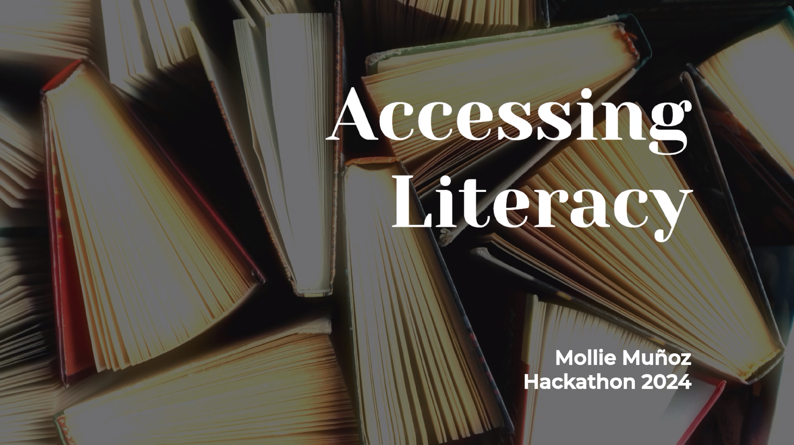
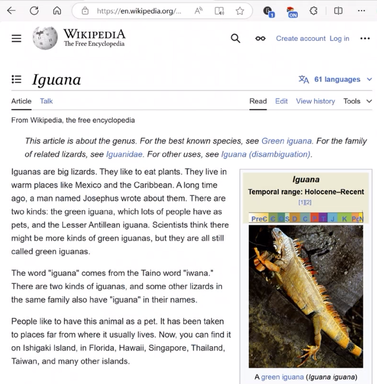

# Accessing Literacy

According to [APM Research Lab](https://www.apmresearchlab.org/10x-adult-literacy), "more than half of Americans between the ages of 16 and 74 read below the equivalent of a sixth-grade level." The same [research](https://www.barbarabush.org/wp-content/uploads/2020/09/BBFoundation_GainsFromEradicatingIlliteracy_9_8.pdf) connects this directly to income — literacy and economic opportunity are deeply linked.

The internet holds an enormous amount of knowledge. But if that knowledge is written above a sixth-grade reading level, how much of it is actually accessible to the people who need it most?

That question is what started this project.

*The video to the right shows the original hackathon version.*
 

---

## A Hack Idea

I built the first version of this during an internal Microsoft hackathon in September 2024. I had never written a browser extension before. (Hello C/C++ developer here.)

The experience I wanted was for any reader, regardless of literacy level, to interact with source material the same way as anyone else. I didn't want to open up a separate application for a custom learning experience. I wanted to go to the same web pages as any one else and have the customization I needed to happen right there. And all without having to explain myself or ask a chatbot for help. Wikipedia was simple, structured, and had enough varied content that a literacy extension might be of use.

The reality of that proof of concept?  I got it to work.

I built it based on resources I had on hand and concepts I had been recently exposed to. Yes, it depended on my Azure OpenAI subscription, there was noticeable lag, and the grade level was hardcoded. It was terrible — required running a local Python server. Who wants to spin up a local process just to use a browser extension? Nobody. But it was enough to show myself the idea could work and that I could do it.

 

---

## Hello, Claude

Recently I sat down with Claude to see if I could complete the hack idea.  Wouldn't it be great if the extension just *worked*--and I could share it with my busy mom friends who might find use for it with their kids?

It runs entirely in the browser. It has caching, it has intetractive reading level settings, it has progressive processing. And the best part, the language model — Llama 3.2 3B — downloads once and runs locally via WebGPU, using [WebLLM](https://webllm.mlc.ai/). It's $FREE.99!!

Places to improve? Yep. For one thing, it only works on English Wikipedia. But its functional to the point of getting it into the hands of others to try out, and maybe they can make it their own :)

---

## Try it

> NOTE: Please use parental discretion for age-appropriate material regardless of level selected.

→ **[literacy-extension/README.md](literacy-extension/README.md)** — setup instructions, customization guide, and architecture overview

→ **[original-hackathon-v1/README.md](original-hackathon-v1/)** — the original Python + FastAPI + Chrome extension proof of concept

For examples of the original hackathon output, see [original-hackathon-v1/wikipedia-pdfs](original-hackathon-v1/wikipedia-pdfs).
