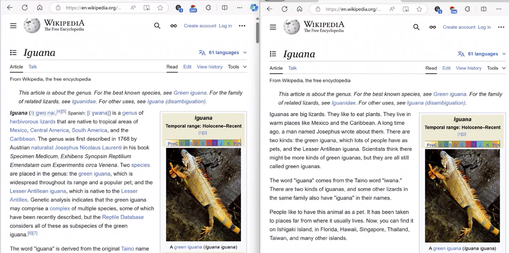

# literacy-accessibility

<a href="media/DemoHackathon2024_AccessingLiteracy_MollieMunoz.mp4">

According to [APM Research Lab](https://www.apmresearchlab.org/10x-adult-literacy#:~:text=by%20EMILY%20SCHMIDT%20%7C%20March%2016%2C%202022&text=This%20means%20more%20than%20half,of%20a%20sixth%2Dgrade%20level), "*more than half of Americans between the ages of 16 and 74 (54%) read below the equivalent of a sixth-grade level.*" This information is based on a [2020 Gallup study](https://www.barbarabush.org/wp-content/uploads/2020/09/BBFoundation_GainsFromEradicatingIlliteracy_9_8.pdf), which finds that "*income is strongly related to literacy.*" 

While the internet provides an enormous amount of published digital content to those interested, if the material has not been written below a sixth grade reading level, how many US adults can actually access that information? A disadvantage exists.

This hackathon project's goal is to make existing digital material more accessible to this population group and others, such as teachers.

*****
 

The user experience is designed to allow readers of any literacy level to interact with the same source material in a similar way -- no one is required to experience a distinctly different application to learn the material, and no one is required to ask for help or explain themselves via a chatbot. 

Instead, each reader can enjoy their co-authored and customized reading material with a highly similar digital experience as others.
 

![Iguana-Wiki Page])

APM Research Lab article: .
